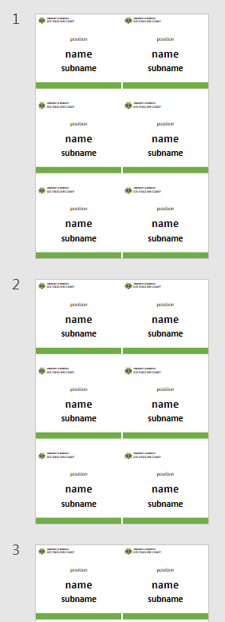
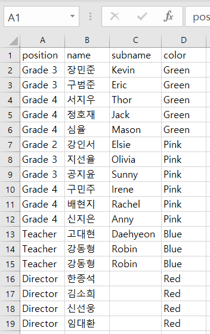
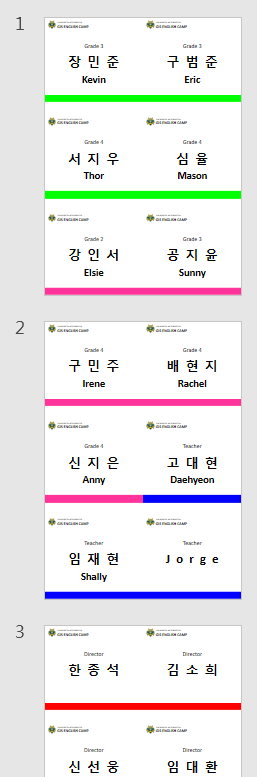
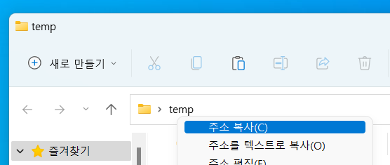
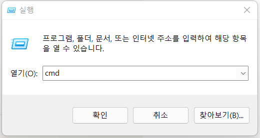
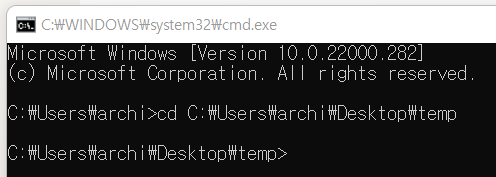
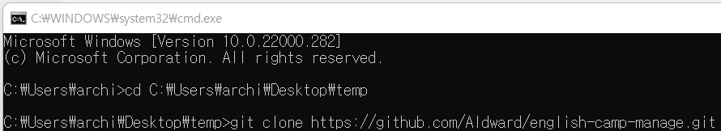
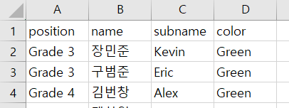
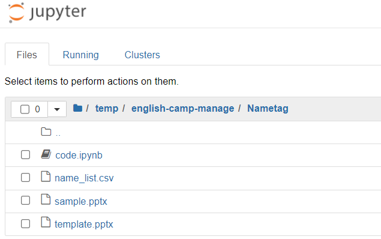

# NametagGenerator

## 이름표 자동 생성 코드 공유

엑셀을 이용하여 자동으로 이름표 시트를 생성하는 방법을 공유합니다

## 코드 실행 결과

  
   
  ➡️
  

## 코드실행 전 설치 리스트

- Anaconda (파이썬 코드 실행 가상환경)

[Installing on Windows - Anaconda documentation](https://docs.anaconda.com/anaconda/install/windows/)

- Git (버전 관리 시스템)

[Windows 컴퓨터 Git 설치하기](https://velog.io/@saakmiso/Windows-%EC%BB%B4%ED%93%A8%ED%84%B0-Git-%EC%84%A4%EC%B9%98%ED%95%98%EA%B8%B0)

## 실행 과정

1. 바탕화면에 폴더 생성 후 주소 복사

2. window+R 누른 후 실행창에서 cmd 입력 후 엔터

3. 그림과 같이 (cd 주소) 입력 후 엔터

4. 아래와 같이 주소 복사

5. 터미널에 (git clone 주소) 입력 후 엔터

6. 생성한 폴더 → english-camp-manage → Nametag → name_list.csv 열고 명단 입력하기 (color는 Red, Green, Blue, Pink, Orange만 사용가능, 맞춤법 틀리면 오류)

7. 생성한 폴더 → english-camp-manage → Nametag → template.pptx 열고 ctrl+D 눌러서 슬라이드 복사(57개를 만들고 싶다면 6의 배수+@, 10개가 되도록 복사 후 저장)
8. window 누르고 jupyter notebook 실행, 폴더로 이동

  
  

  

9. code.ipynb 누른 후 shift + enter 계속 누르면서 코드 실행 (오류 발생 시 tomato247 카톡문의)
10. 동일 폴더에 nametag.pptx 파일이 생성됨, 수고하셨습니다
