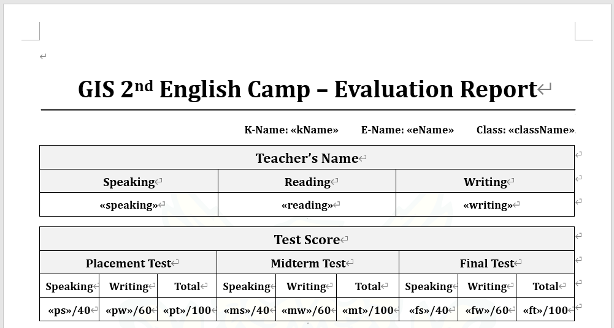
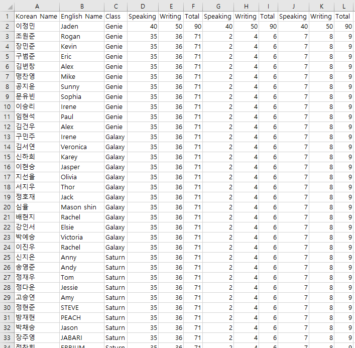
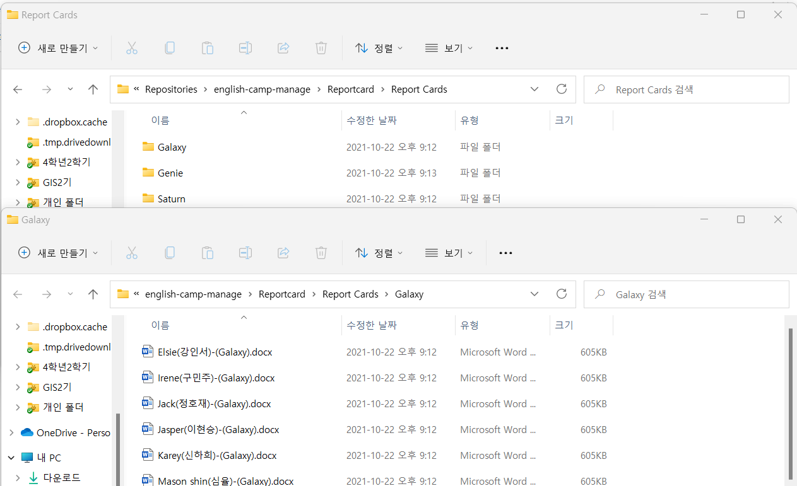
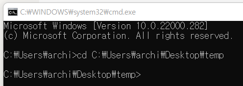
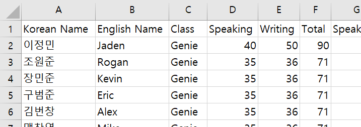
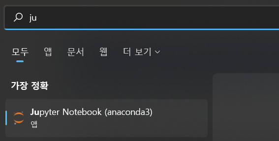
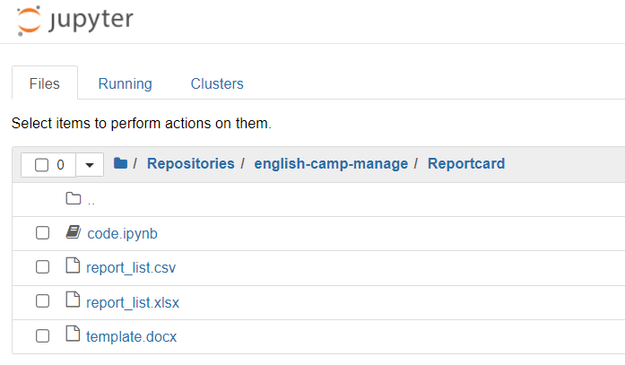

# ReportcardGenerator

## 원어민 보고서 자동 생성 코드 공유

엑셀과 워드, 파이썬 코딩을 이용하여 자동으로 원어민 보고서를 생성하는 방법을 공유합니다

## 코드 실행 결과

워드 템플릿 파일 하나와 엑셀 데이터로 원어민 보고서 템플릿 대량 생성 후 폴더별로 정리 가능

⏬

## 코드실행 전 설치 리스트

- Anaconda (파이썬 코드 실행 가상환경)

[Installing on Windows - Anaconda documentation](https://docs.anaconda.com/anaconda/install/windows/)

- Git (버전 관리 시스템)

[Windows 컴퓨터 Git 설치하기](https://velog.io/@saakmiso/Windows-%EC%BB%B4%ED%93%A8%ED%84%B0-Git-%EC%84%A4%EC%B9%98%ED%95%98%EA%B8%B0)

## 실행 과정

1. 바탕화면에 폴더 생성 후 주소 복사

2. window+R 누른 후 실행창에서 cmd 입력 후 엔터

3. 그림과 같이 (cd 주소) 입력 후 엔터

4. (ctrl 누르고 선택 권장) [https://github.com/AIdward/english-camp-manage](https://github.com/AIdward/english-camp-manage) 페이지로 이동하여 아래와 같이 주소 복사

5. 터미널에 (git clone 주소) 입력 후 엔터

6. 생성한 폴더 → english-camp-manage → Reportcard → report_list.csv 열고 명단 입력하기 (컬럼에 성별이나 학년 등 다른 것 들어가면 안됨, 원래 있던 컬럼 그대로 유지)

7. window 누르고 jupyter notebook 실행, 폴더로 이동

  
  

8. code.ipynb 누른 후 shift + enter 계속 누르면서 코드 실행 (오류 발생 시 tomato247 카톡문의)
9. Report Cards 폴더 안에 모든 템플릿 생성됨, 그대로 구글 드라이브에 업로드하여 원어민 선생님들이 보고서 작성할 수 있게 합시다

## 오류 발생 리스트

- 차차 업로드 예정
